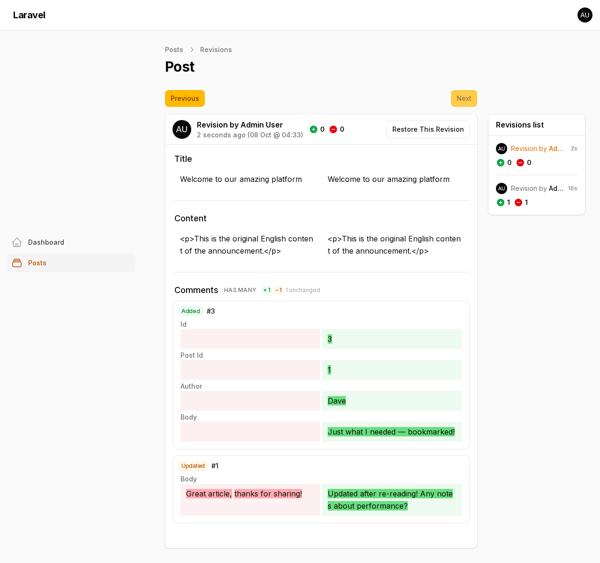
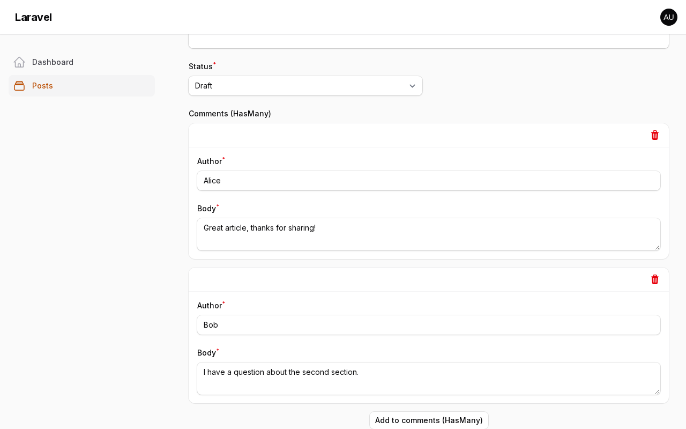
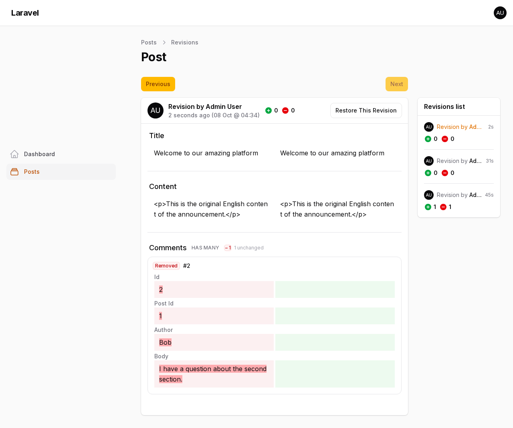

<div align="center">
    
</div>

# Filament Versionable

[](https://packagist.org/packages/mansoor/filament-versionable)
[](https://github.com/mansoorkhan96/filament-versionable/actions/workflows/run-tests.yml)
[](https://github.com/mansoorkhan96/filament-versionable/actions/workflows/fix-php-code-styling.yml)
[](https://packagist.org/packages/mansoor/filament-versionable)

Efforlessly manage your Eloquent model revisions in Filament. It includes:

- A Filament page to show the Diff of what has changed and who changed it
- A list of Revisions by different users
- A Restore action to restore the model to any state


## Installation

You can install the package via composer:

```bash
composer require mansoor/filament-versionable
```

Then, publish the config file and migrations:

```bash
php artisan vendor:publish --provider="Overtrue\LaravelVersionable\ServiceProvider"
```

Run the migration command:

```bash
php artisan migrate
```

> [!IMPORTANT]
> If you have not set up a custom theme and are using Filament Panels follow the instructions in the [Filament Docs](https://filamentphp.com/docs/4.x/styling/overview#creating-a-custom-theme) first.

After setting up a custom theme add the plugin's views and css to your theme css file.

```css
@import '../../../../vendor/mansoor/filament-versionable/resources/css/plugin.css';
@source '../../../../vendor/mansoor/filament-versionable/resources/**/*.blade.php';
```

## Usage

Add `Overtrue\LaravelVersionable\Versionable` trait to your model and set `$versionable` attributes.

**NOTE: Make sure to add `protected $versionStrategy = VersionStrategy::SNAPSHOT;` This would save all the $versionable attributes when any of them changed. There are different bug reports on using VersionStrategy::DIFF**

```php
use Overtrue\LaravelVersionable\VersionStrategy;

class Post extends Model
{
    use Overtrue\LaravelVersionable\Versionable;

    protected $versionable = ['title', 'content'];

    protected $versionStrategy = VersionStrategy::SNAPSHOT;
}
```

Create a Revisons Resource page to show Revisions, it should extend the `Mansoor\FilamentVersionable\RevisionsPage`. If you were to create a Revisions page for `ArticleResource`, it would look like:

```php
namespace App\Filament\Resources\ArticleResource\Pages;

use App\Filament\Resources\ArticleResource;
use Mansoor\FilamentVersionable\RevisionsPage;

class ArticleRevisions extends RevisionsPage
{
    protected static string $resource = ArticleResource::class;
}
```

Next, Add the ArticleRevisions page (that you just created) to your Resource

```php
use App\Filament\Resources\ArticleResource\Pages;

public static function getPages(): array
{
    return [
        ...
        'revisions' => Pages\ArticleRevisions::route('/{record}/revisions'),
    ];
}
```

Add `RevisionsAction` to your edit/view pages, this action would only appear when there are any versions for the model you are viewing/editing.

```php
use Mansoor\FilamentVersionable\Page\RevisionsAction;

protected function getHeaderActions(): array
{
    return [
        RevisionsAction::make(),
    ];
}
```

You can also add the `RevisionsAction` to your table.

```php
use Mansoor\FilamentVersionable\Table\RevisionsAction;

$table->actions([
    RevisionsAction::make(),
]);
```

You are all set! Your app should store the model states and you can manage them in Filament.

## Versioning Relationships

By default only the model's own attributes are versioned. To also snapshot relationships (HasMany, HasOne, MorphMany, MorphOne, BelongsToMany, MorphToMany, and display-only BelongsTo / MorphTo / HasManyThrough / HasOneThrough), use the `HasVersionableRelations` concern and list the relationship names:

```bash
php artisan vendor:publish --tag="filament-versionable-migrations"
php artisan migrate
```

```php
use Mansoor\FilamentVersionable\Concerns\HasVersionableRelations;
use Overtrue\LaravelVersionable\Versionable;

class Post extends Model
{
    use Versionable;
    use HasVersionableRelations;

    protected $versionable = ['title', 'content'];

    // Simple form: just list the relationship names.
    protected array $versionableRelations = ['comments', 'tags'];
}
```

### Per-relation configuration

Every relationship can also be configured: what the revisions page shows, and how a snapshotted record is re-identified on restore when its primary key no longer matches (deleted and re-created rows, restores into another environment, ...):

```php
protected array $versionableRelations = [
    'comments' => [
        // Shown next to the record key on the revisions page instead of a bare
        // "#5". Accepts an attribute name or a callable:
        // fn (array $attributes, int|string $key) => string.
        'title' => 'author',

        // Which snapshot attributes to render on the revisions page
        // (default: all of them).
        'fields' => ['author', 'body'],

        // Stable columns used to re-identify a row on restore when its
        // primary key is gone (optional).
        'identity' => ['author', 'body'],

        // Re-create missing children with their original primary key when
        // that key is still free (default: true).
        'preserve_ids' => true,
    ],

    // Unconfigured relations keep the defaults.
    'tags',
];
```

Without any configuration a sensible title is guessed from common attribute
names (`name`, `title`, `label`, `author`, `email`, `username`, `slug`), so
rows never show a naked primary key.

- Every created version stores a snapshot of the listed relationships, and the revisions page renders per-relation change sets (added / updated / removed records with field-level diffs, plus pivot column changes).
- When **only** a relationship changes, Filament's attribute watcher would normally create no version at all — the plugin now records one automatically after Filament saves the record.
- Restoring a revision automatically restores the relationship state as well. Each snapshotted record is resolved against the current database in tiers — always scoped to the relation's own constraint, so rows of other parents are never touched:
    1. **Primary key** — the normal, untouched case (soft-deleted children are revived).
    2. **Attribute fingerprint** — every snapshotted attribute matches exactly; covers rows that were deleted and re-created with the same data, and restores into environments where the same data has different keys.
    3. **Identity columns** — the stable columns you designate via `'identity'`; covers rows that were legitimately edited since the snapshot.
    4. **Re-create** — nothing identifiable: the child is re-created, with its original primary key when that key is still free and `preserve_ids` is enabled.
- Children missing from the snapshot are removed, pivot relations are synced (including pivot columns, re-linked to re-created master records), and a `BelongsTo` foreign key pointing at a since re-created row is re-pointed automatically.
- `MorphTo`, `HasManyThrough` and `HasOneThrough` are recorded for reference only — restoring them would either duplicate data owned by other records or is not directly writable, so their snapshots are never applied. A `BelongsTo` foreign key is still restored like any other versioned attribute when listed in `$versionable`.
- Models that don't use the concern behave exactly as before.

> 🎬 **Watch the demo:** [relationships-demo.mp4](.github/videos/relationships-demo.mp4) — editing and adding comments, reviewing the relation diff, and restoring a revision with the relationships coming back automatically.

**Revisions page — per-relation change sets with field-level diffs:**



**Automatic restore** — after restoring a revision, the edit form shows the relationships exactly as they were in that revision (removed children are gone, modified children are reverted):



**Removed records** are tracked too:



## Customisation

If you want to change the UI for Revisions page, you may publish the publish the views to do so.

```bash
php artisan vendor:publish --tag="filament-versionable-views"
```

If you want more control over how the versions are stored, you may read the [Laravel Versionable Docs](https://github.com/overtrue/laravel-versionable).

## Strip Tags from Diff

You can easily remove/strip HTML tags from the diff by just overriding `shouldStripTags` method inside your revisions page.

```php
class ArticleRevisions extends RevisionsPage
{
    protected static string $resource = ArticleResource::class;

    public function shouldStripTags(): bool
    {
        return true;
    }
}
```

## Testing

```bash
composer test
```

## Changelog

Please see [CHANGELOG](CHANGELOG.md) for more information on what has changed recently.

## Contributing

Please see [CONTRIBUTING](.github/CONTRIBUTING.md) for details.

## Security Vulnerabilities

Please review [our security policy](../../security/policy) on how to report security vulnerabilities.

## Credits

- [Mansoor Ahmed](https://github.com/mansoorkhan96)
- [安正超](https://github.com/overtrue) for [Laravel Versionable](https://github.com/overtrue/laravel-versionable)
- [All Contributors](../../contributors)

## License

The MIT License (MIT). Please see [License File](LICENSE.md) for more information.
